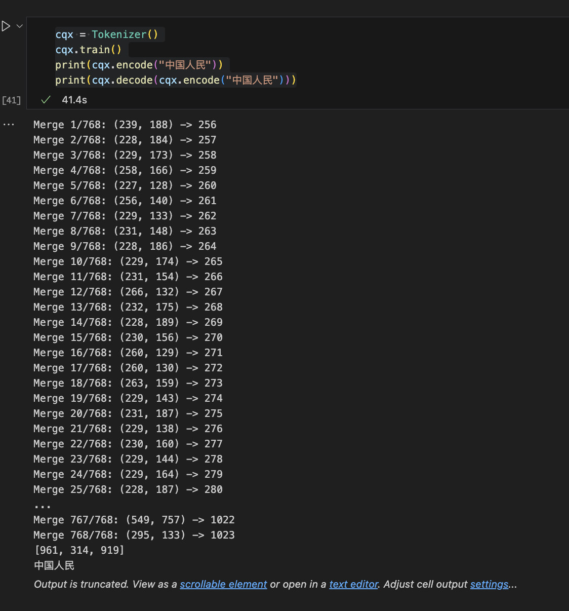
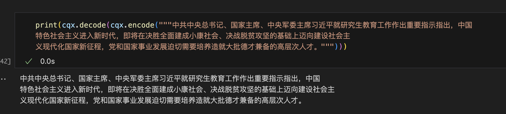
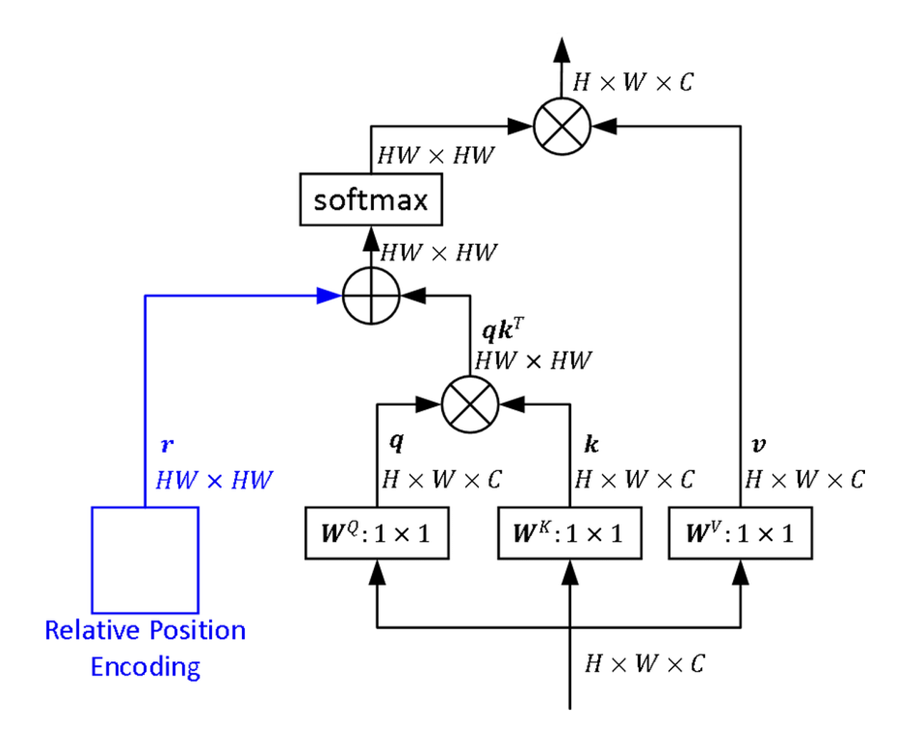
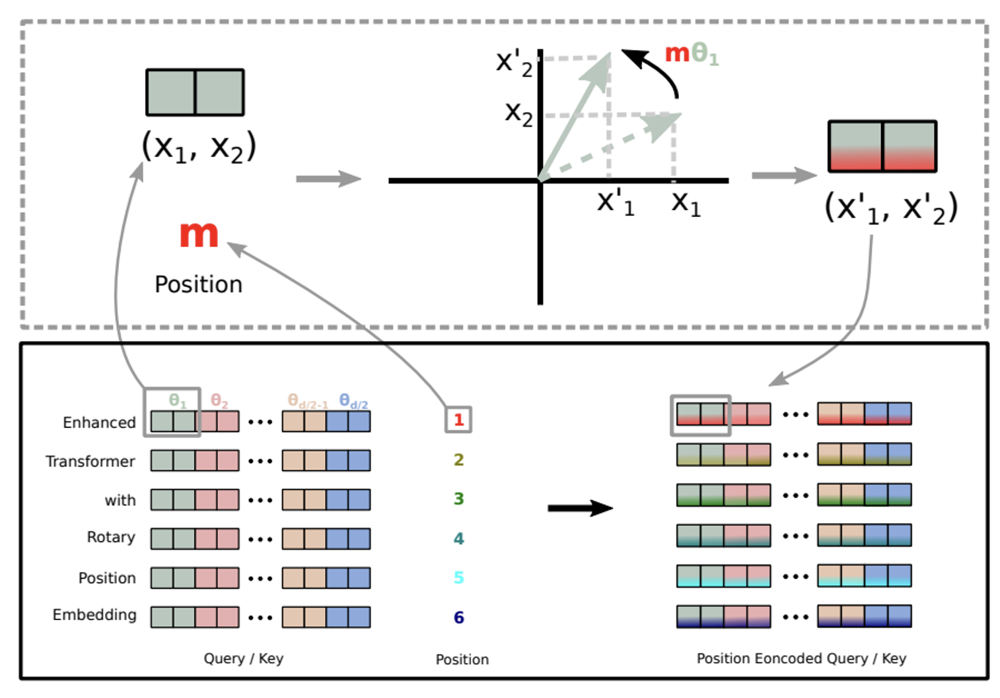
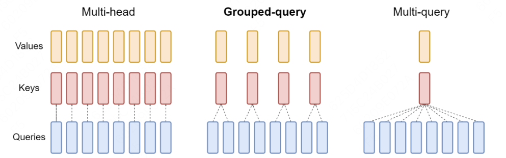
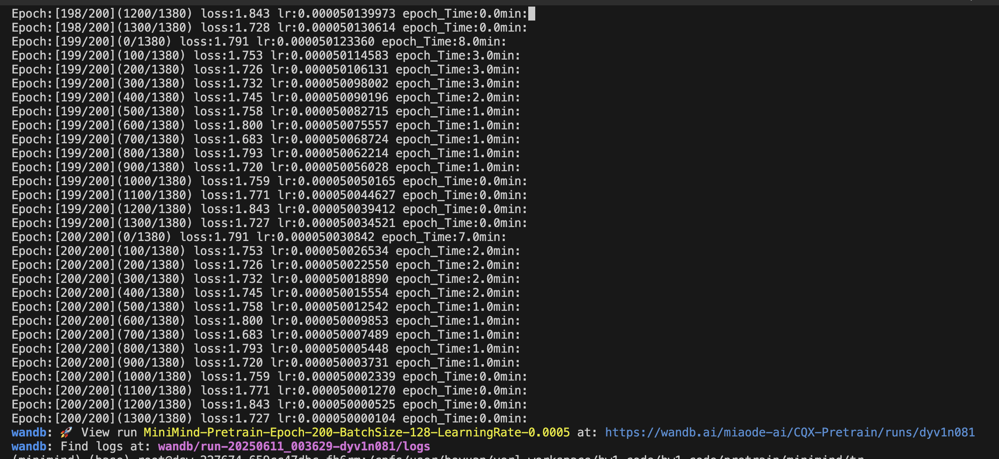

# 1. Tokenization (10分)

## 1.1 实现BPE，训练Tokenizer（6分）
### 【1分】在实验报告中简要概述一下BPE算法和基于BPE算法训练LLM tokenizer的流程。
BPE每一步都将最常见的一对相邻数据单位替换为该数据中没有出现过的一个新单位，反复迭代直到满足停止条件。
我自己的理解就是：
1. 首先每一个字符的 utf-8 编码，假设，"aaabdaaabac" （这是编码后的raw token）。
2. 然后我们利用 get_stats 函数来统计频率最高的两个raw token. 比如例子中的 "aa" 我们使用 X 来代替。
3. 然后我们需要合并. 得到"XabdXabac" 
将以上的过程循环直到无法再合并，无法再合并的条件可以是达到最大的 vocab_size, 或者没有重复的可以继续合并的 raw token了。 
（这部分代码与 Andrej Karpathy 相同，为了节省空间，我放在了 bpe.ipynb 文件中.）

### 【2分】实现一个基于BPE算法的tokenizer，它的主要接口如下：
代码在 bpe.ipynb 
```python
class Tokenizer:
    def __init__(self):
        # 指定默认文本文件路径（用于训练）
        self.file_path = "/cpfs/user/boyuan/verl_workspace/hw1_code/hw1-code/bpe/manual.txt"
        
        # 初始化初始 vocabulary：所有单字节（0-255）的映射，每个 ID 对应其单字节字节串
        self.vocab = {i: bytes([i]) for i in range(256)}
        
        # 词表目标大小，默认为 1024，意味着会训练 768 个新 token（1024 - 256）
        self.vocab_size = 1024
        
        # 初始化空的合并规则表，用于记录每次 BPE 合并产生的新 token
        self.merges = {}

    def get_stats(self, ids):
        # 统计当前 token 序列中所有相邻 token 对的频率
        counts = {}
        for pair in zip(ids, ids[1:]):  # 逐对扫描 ids
            counts[pair] = counts.get(pair, 0) + 1  # 累加该 pair 的出现次数
        return counts  # 返回所有 pair 的频率统计表

    def merge(self, ids, pair, idx):
        # 将给定的 pair 替换为新的 token idx
        newids = []  # 存储新生成的 token 序列
        i = 0
        while i < len(ids):
            # 如果当前位置及下一个位置正好是待合并的 pair，则合并为新 token idx
            if i < len(ids) - 1 and ids[i] == pair[0] and ids[i + 1] == pair[1]:
                newids.append(idx)
                i += 2  # 跳过两个 token（已经合并）
            else:
                newids.append(ids[i])
                i += 1  # 保留当前 token，继续处理下一位
        return newids  # 返回替换后的 token 列表

    def train(self, text=None, vocab_size=1024):
        """
        用 BPE 算法训练 tokenizer。
        参数:
            text (str): 可选。输入的原始文本。
            vocab_size (int): 最终 vocab 的目标大小。
        """
        if text:
            # 如果传入了文本，就使用它
            self.text = text
        else:
            # 否则从默认文件中读取文本内容
            with open(self.file_path, 'r', encoding='utf-8') as f:
                self.text = f.read()

        # 将文本编码为 UTF-8 字节序列并存为整数列表
        self.ids = list(self.text.encode("utf-8"))
        self.vocab_size = vocab_size

        # 需要进行的合并次数 = 目标词表大小 - 初始字节表大小
        num_train = self.vocab_size - 256

        # 迭代进行 BPE 合并
        for i in range(num_train):
            # 统计当前 ids 中的高频相邻对
            stats = self.get_stats(self.ids)
            pair = max(stats, key=stats.get)  # 找到频率最高的 token 对
            idx = 256 + i  # 新 token 的 ID，从 256 开始

            print(f"Merge {i+1}/{num_train}: {pair} -> {idx}")

            # 将频率最高的 pair 替换为新 token
            self.ids = self.merge(self.ids, pair, idx)

            # 将新 token 的实际字节串添加进 vocab
            self.vocab[idx] = self.vocab[pair[0]] + self.vocab[pair[1]]

            # 将该合并操作记录到 merges 中（用于之后编码）
            self.merges[pair] = idx

    def encode(self, text):
        """
        编码函数：将输入字符串转换为 token ID 列表。
        参数:
            text (str): 输入字符串
        返回:
            ids (list): 编码后 token 的 ID 列表
        """
        # 将文本转为 UTF-8 字节 ID 列表
        tokens = list(text.encode("utf-8"))

        # 不断合并已知的 pair，直到不能合并为止
        while len(tokens) >= 2:
            stats = self.get_stats(tokens)
            # 找到当前最早被加入 merges 的 pair（优先合并已有的规则）
            pair = min(stats, key=lambda p: self.merges.get(p, float("inf")))

            if pair not in self.merges:
                break  # 如果找不到可合并的 pair，则终止合并

            idx = self.merges[pair]  # 获取该 pair 合并后的 token ID
            tokens = self.merge(tokens, pair, idx)  # 执行合并
        return tokens  # 返回最终 token ID 列表

    def decode(self, ids):
        """
        解码函数：将 token ID 列表转换回字符串。
        参数:
            ids (list): token ID 列表
        返回:
            text (str): 解码后的字符串
        """
        # 将每个 ID 映射回其字节串，拼接后解码为 UTF-8 字符串
        return b"".join(self.vocab[idx] for idx in ids).decode("utf-8", errors="replace")

```



<!-- ./hw1-code/bpe -->


### 【1分】hw1-code/bpe/manual.txt是《北京大学研究生手册（2023版）》中提取出来的文字，请你用它来训练你的tokenizer，vocab_size为1024。
已实现在Class Tokenizer的 train 函数中。


### 【1分】用它来encode再decode manual.txt，检查与原始manual.txt是否完全一致？
是的.



### 【1分】学习使用huggingface transformers中的tokenizer，使用它加载GPT-2的tokenizer，然后使用它和你训练的tokenizer分别encode以下句子，比较两者的输出，简要解释长度上和具体token上不同的原因是什么。
```python
from transformers import GPT2Tokenizer

# GPT-2 tokenizer
gpt2_tokenizer = GPT2Tokenizer.from_pretrained("gpt2",use_auth_token=False)
cqx = Tokenizer()
cqx.train()

# 使用 """ 多行字符串包裹的英文和中文长句
sentence1 = """Originated as the Imperial University of Peking in 1898, Peking University was China’s first national comprehensive university and the supreme education authority at the time. Since the founding of the People’s Republic of China in 1949, it has developed into a comprehensive university with fundamental education and research in both humanities and science. The reform and opening-up of China in 1978 has ushered in a new era for the University unseen in history. And its merger with Beijing Medical University in 2000 has geared itself up for all-round and vibrant growth in such fields as science, engineering, medicine, agriculture, humanities and social sciences. Supported by the “211 Project” and the “985 Project”, the University has made remarkable achievements, such as optimizing disciplines, cultivating talents, recruiting high-caliber teachers, as well as teaching and scientific research, which paves the way for a world-class university.”"""
sentence2 = """博士学位论文应当表明作者具有独立从事科学研究工作的能力，并在科学或专门技术上做出创造性的成果。博士学位论文或摘要，应当在答辩前三个月印送有关单位，并经同行评议。学位授予单位应当聘请两位与论文有关学科的专家评阅论文，其中一位应当是外单位的专家。评阅人应当对论文写详细的学术评语，供论文答辩委员会参考。 """

for i, (name, text) in enumerate([("Sentence 1 (English)", sentence1), ("Sentence 2 (Chinese)", sentence2)], 1):
    print(f"{'='*30}【{name}】")

    # GPT-2 encode
    gpt2_ids = gpt2_tokenizer.encode(text, add_special_tokens=False)
    print(f"▶ GPT-2 Tokenizer:")
    print(f"- Token Count: {len(gpt2_ids)}")
    print(f"- First 10 Token IDs: {gpt2_ids[:20]}")
    print(f"- First 10 Tokens: {[gpt2_tokenizer.decode([t]) for t in gpt2_ids[:100]]}")

    # Custom tokenizer encode
    custom_ids = cqx.encode(text)
    print(f"▶ cqx own BPE Tokenizer:")
    print(f"- Token Count: {len(custom_ids)}")
    print(f"- First 10 Token IDs: {custom_ids[:20]}")
    print(f"- Decoded (First 100 IDs): {cqx.decode(custom_ids[:100])}")

# ==============================
# 【Sentence 1 (English)】

# ▶ GPT-2 Tokenizer:
# - Token Count: 187
# - First 10 Token IDs: [11610, 3898, 355, 262, 11773, 2059, 286, 350, 18754, 287, 46244, 11, 350, 18754, 2059, 373, 2807, 447, 247, 82]
# - First 10 Tokens: ['Orig', 'inated', ' as', ' the', ' Imperial', ' University', ' of', ' P', 'eking', ' in', ' 1898', ',', ' P', 'eking', ' University', ' was', ' China', '�', '�', 's', ' first', ' national', ' comprehensive', ' university', ' and', ' the', ' supreme', ' education', ' authority', ' at', ' the', ' time', '.', ' Since', ' the', ' founding', ' of', ' the', ' People', '�', '�', 's', ' Republic', ' of', ' China', ' in', ' 1949', ',', ' it', ' has', ' developed', ' into', ' a', ' comprehensive', ' university', ' with', ' fundamental', ' education', ' and', ' research', ' in', ' both', ' humanities', ' and', ' science', '.', ' The', ' reform', ' and', ' opening', '-', 'up', ' of', ' China', ' in', ' 1978', ' has', ' ushered', ' in', ' a', ' new', ' era', ' for', ' the', ' University', ' unseen', ' in', ' history', '.', ' And', ' its', ' merger', ' with', ' Beijing', ' Medical', ' University', ' in', ' 2000', ' has', ' geared']

# ▶ cqx own BPE Tokenizer:
# - Token Count: 943
# - First 10 Token IDs: [79, 114, 105, 103, 105, 110, 97, 116, 101, 100, 32, 97, 115, 32, 116, 104, 101, 32, 73, 109]
# - Decoded (First 100 IDs): Originated as the Imperial University of Peking in 1898, Peking University was China’s first national 

# ==============================
# 【Sentence 2 (Chinese)】

# ▶ GPT-2 Tokenizer:
# - Token Count: 307
# - First 10 Token IDs: [39355, 248, 18803, 27764, 99, 19526, 235, 164, 106, 118, 23877, 229, 41753, 242, 37605, 241, 26193, 101, 23626, 236]
# - First 10 Tokens: ['�', '�', '士', '�', '�', '�', '�', '�', '�', '�', '�', '�', '�', '�', '�', '�', '�', '�', '�', '�', '作', '者', '�', '�', '�', '�', '�', '�', '�', '�', '�', '�', '�', '�', '�', '�', '�', '�', '�', '�', '�', '�', '�', '�', '�', '�', '�', '作', '的', '�', '�', '�', '�', '�', '�', '�', '�', '�', '�', '�', '�', '�', '�', '�', '�', '�', '�', '�', '�', '�', '�', '�', '�', '�', '�', '�', '上', '�', '�', '�', '�', '�', '�', '�', '�', '�', '�', '�', '的', '�', '�', '�', '�', '�', '。', '�', '�', '士', '�', '�']

# ▶ cqx own BPE Tokenizer:
# - Token Count: 119
# - First 10 Token IDs: [454, 508, 520, 710, 619, 341, 453, 670, 351, 231, 139, 172, 722, 979, 550, 909, 294, 419, 267, 1022]
# - Decoded (First 100 IDs): 博士学位论文应当表明作者具有独立从事科学研究工作的能力，并在科学或专门技术上做出创造性的成果。博士学位论文或摘要，应当在答辩前三个月印送有关单位，并经同行评议。学位授予单位应当聘请两位与论文有关学科的专家评阅论文，其中一位应当是外单位的专家。评阅人应当对
```


在中文方面：GPT2 没有在中文上学习过，而中文的字符会由好几个  字节（bytes） 来表示，并且在 decode 的阶段，由于他的词表里面没有中文这个字符，因此输出乱码。我的 bpe 由于使用中文语料因此能够正确的理解和识别。 
在英文方面：我的 bpe 由于没有在英语上训练过因此会把一个单词都切分成 a,b,c,d... 这样的形式，导致 token 数量非常多。但是我的 bpe 是能够正确 decode 出来原本内容的，相较于 gpt2 在中文的表现而是 decode 出乱码。


## 1.2 回答问题（4分）
### Python中使用什么函数查看字符的Unicode，什么函数将Unicode转换成字符？并使用它们查看“北”“大”的Unicode，查看Unicode为22823、27169、22411对应的字符。
```python
print(ord("北"))  # 21271
print(ord("大"))  # 22823

print(chr(22823))  # 大
print(chr(27169))  # 模
print(chr(22411))  # 型
```
    
### Tokenizer的vocab size大和小分别有什么好处和坏处？
vocab size 小
- 好处： 泛化能力强；训练数据少时不易过拟合
- 坏处：编码长度更长，解码开销大

vocab size 大
- 好处：能合并更多词/子词，减少 token 数量；加快推理速度
- 坏处：模型参数更多，训练更慢，容易过拟合

### 为什么 LLM 不能处理非常简单的字符串操作任务，比如反转字符串？

因为 tokenization 的过程会影响字符串的顺序，字符到 token 的合并和转换会使得模型很难学习到字符之间的顺序关系，除非有进一步的数据进行训练。

### 为什么 LLM 在非英语语言（例如日语）上表现较差？

因为这些语言不是有 abcd等字母组合拼接而成，而且不像英语有空格作为分割，还有词表的大小很可能没有收纳非英语字符，出现了 OOV（out-of-vocabulary） 现象。

### 为什么 LLM 在简单算术问题上表现不好？
这个问题涉及到 LLM 的学习机制，比如 SFT 倾向于 memorize。 分词的影响也会对其有显著影响，比如 200000，tokenizer 切分成 200，和 000 就会导致数学上的计算出错。

### 为什么 GPT-2 在编写 Python 代码时遇到比预期更多的困难？
由于 python代码非常多的缩进和空格，导致 token 的浪费。

### 为什么 LLM 遇到字符串 “<|endoftext|>” 时会突然中断？
因为这个是 GPT 类模型默认的 special token，模型可能会识别到特殊字符然后终止输出。

### 为什么当问 LLM 关于 “SolidGoldMagikarp” 的问题时 LLM 会崩溃？
在 GPT 的 BPE tokenizer 中，它被作为 一个完整 token，而且其训练频率极低。

### 为什么在使用 LLM 时应该更倾向于使用 YAML 而不是 JSON？
因为 YAML 的形式更为宽松并且更加贴切自然语言，可读性更高。

### 为什么 LLM 实际上不是端到端的语言建模？
Tokenization 把字符拆分成子词，使模型学到的是 token 间关系，而不是字符级语言建模。
Tokenization 实际上是独立于 LLM 的学习的，使用的数据很可能也不同。


##  LLM Implementation (10分)
    【3分】完整代码，路径为hw1-code/pretrain
    
    【7分】实验报告
### Embedding
一般的 Embedding 有 3 中: 
- Absolute Positional Encoding, APE
- Relative Positional Encoding, RPE
- Rotary Positional Embedding, RoPE

Input 在经过 Tokenization 之后，需要进入 Embedding 层，将离散输入的 idea 转换成连续的向量. 

#### APE: 
使用三角函数生成的固定编码,支持外推长序列. Sinusoidal 编码.
> $$ PE_{pos,2i} = sin(pos/1000^{2i/d_{model}})$$
>
> $$PE_{pos,2i+1} = cos(pos/1000^{2i/d_{model}})$$

特点：无需训练，具有周期性外推能力，但是无法直接表达相对位置关系。
适用：短文本翻译
局限：长序列，超过 512 性能下降，需要微调或扩展。

#### RPE：
建模序列中任意两位置的相对距离而非绝对索引，增强模型对局部结构的感知力.
相对位置信息在 self-attention 计算的时候丢失，因此在 self-attention 计算的过程中再加上。
具体方法是，在计算attention score 和 weighted value 时，加入可训练表示相对位置的参数，multihead 之间可以共享。
> $$z_{i} = \sum_{j-1}^{n} a_{ij}(x_{j} W^{v} + a_{ij}^{V})$$
>
> $$ e_{ij} = \frac{x_{i}W^{Q}(x_jW^K + a_{ij}^K)^T}{\sqrt{d_z}}$$ 


#### RoPE: 
将位置信息编码成旋转矩阵，作用于 Query 和 Key 的注意力计算中，隐式融合绝对位置和相对位置的双重特性。RoPE位置通过将一个向量旋转某个角度，为其赋予位置信息。
优点：
外推性强，支持超长序列推理。
远程衰减：通过波长设计自动衰减远距离依赖
数学等价：通过旋转操作实现相对位置偏移的数学等价性
适用：长文本生成；多模态任务（图文对齐）；灵活适配不同模态的序列长度。



通过绝对位置编码的方式，来实现了一个相对位置的编码。对词向量 q 添加绝对位置信息m，得到 qm。
> $$ q_m = f(q,m) $$
RoPE 希望 qm 与 kn 之间的点积，f(q,m)·f(k,n) 中能带有相对位置信息m-n；为此，我们需要一个新的函数 g(q,k,m-n)。 m-n 表示 两个向量之间相对位置信息：
f(q,m) * f(q,n) = g(q,k,m-n)


* 假设词向量是二维，作者得到如下位置编码函数，其中 $m$ 为位置下标，$\theta$ 为常数：

  $$
  f(q, m) = R_m q = 
  \begin{pmatrix}
  \cos m\theta & -\sin m\theta \\
  \sin m\theta & \cos m\theta
  \end{pmatrix}
  \begin{pmatrix}
  q_0 \\
  q_1
  \end{pmatrix}
  $$

* 以二维向量 $(1, 0)$ 为例，将其逆时针旋转 45 度，即角度为 $\frac{\pi}{4}$，将得到新的二维向量，向量的模长未发生改变，仍然是 1。计算过程如下：

  $$
  \begin{pmatrix}
  \cos \frac{\pi}{4} & -\sin \frac{\pi}{4} \\
  \sin \frac{\pi}{4} & \cos \frac{\pi}{4}
  \end{pmatrix}
  \begin{pmatrix}
  1 \\
  0
  \end{pmatrix}
  =
  \begin{pmatrix}
  \cos \frac{\pi}{4} \\
  \sin \frac{\pi}{4}
  \end{pmatrix}
  =
  \begin{pmatrix}
  \frac{\sqrt{2}}{2} \\
  \frac{\sqrt{2}}{2}
  \end{pmatrix}
  $$

RoPE 代码如下


### Attention
我这里实现的 Attention Block 包含以下机制和模块.
1. GQA 2. KV Cache 3. SwiCLU

#### GQA
分组查询注意力机制(Group Querey Attention, GQA),是Multihead Attention (MHA) 的拓展，将 h 个heads, 分为 G 组，每组包含 h/G 个 heads，共享一个公共的 key 和 value。
相比传统的 MHA，减少了 Key 和 value 的数量，降低了计算量和内存开销，提高了推理维度。



#### KV Cache

在语言模型生成文本的过程中，每生成一个新的 token，模型都需要计算注意力得分，以确定当前位置与之前所有位置的相关性。

例如：

1. **当输入序列为** `\[tok1]`：

   ```
   attn_11 = softmax(Q1 · K1ᵀ / √d) · V1
   ```

2. **当输入序列为** `\[tok1, tok2]`：

   ```
   attn_11 = softmax(Q1 · K1ᵀ / √d) · V1
   attn_12 = 0  (masked)

   attn_21 = softmax(Q2 · K1ᵀ / √d) · V1
   attn_22 = softmax(Q2 · K2ᵀ / √d) · V2
   ```

3. **当输入序列为** `\[tok1, tok2, tok3]`：

   ```
   attn_11 = softmax(Q1 · K1ᵀ / √d) · V1
   attn_12 = 0  (masked)
   attn_13 = 0  (masked)

   attn_21 = softmax(Q2 · K1ᵀ / √d) · V1
   attn_22 = softmax(Q2 · K2ᵀ / √d) · V2
   attn_23 = 0  (masked)

   attn_31 = softmax(Q3 · K1ᵀ / √d) · V1
   attn_32 = softmax(Q3 · K2ᵀ / √d) · V2
   attn_33 = softmax(Q3 · K3ᵀ / √d) · V3
   ```


---

不难发现，大模型在生成每一个 token 时的注意力计算中，总会重复使用历史 token 的 Key 和 Value 值。
KV Cache 的设计就是为了缓存这些历史 KV 值，避免重复计算，从而节省计算资源。

>  KV Cache 能够有效压缩大模型推理时的显存占用。


#### SwiGLU

**SwiGLU** 是一种在深度学习中用于神经网络架构的激活函数变体，定义为：

$$
\text{SwiGLU}(x, W, V, b, c) = \text{Swish}_1(xW + b) \otimes (xV + c)
$$

与传统的 ReLU 激活函数相比，SwiGLU 具有更好的平滑性和非线性表达能力。
由于其引入门控机制，在处理信息筛选与流动方面具有独特优势。





# LoRA Fine-tuning (10分)
    【1分】完整地运行代码，提交运行记录（即保留你运行记录的ipynb文件）
    【2分】使用原始的数据集完成首次训练，提交训练loss曲线和模型生成结果
    【3分】结合上课所学lora知识，调试lora超参数，根据训练曲线和模型生成结果，分析lora超参数对于模型效果的影响。
    【2分】基于先前的最优超参数，修改训练数据集为Alpaca数据集，并使用lora进行微调。
    【2分】基于Alpaca数据集调试lora超参数，判断两个数据集对应的超参数是否有差异，并尝试分析原因。


### self-play: 这次的作业基本上没有什么难度.我觉得可以再自己写一写 多模态的 minimind， 那图片再自己 train一个版本的 mllm
### Llava-COT
### opendeepresearch. 
### 
